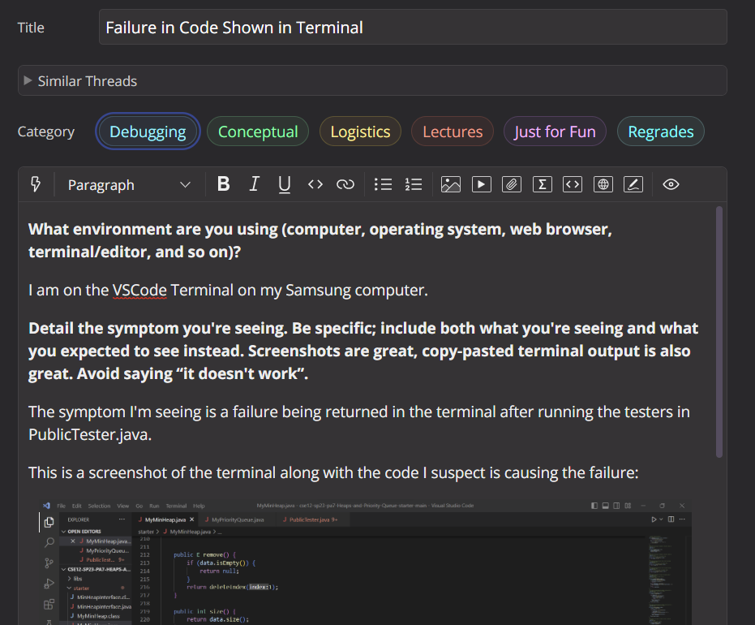
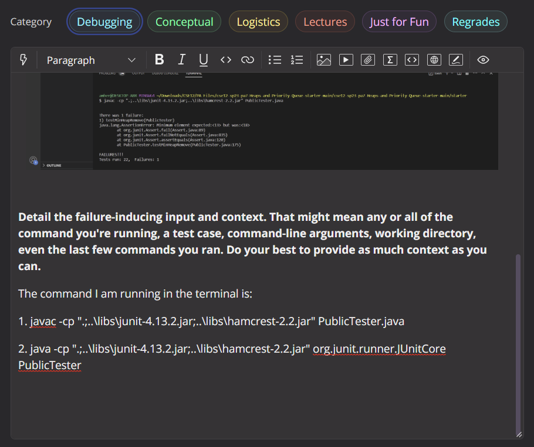
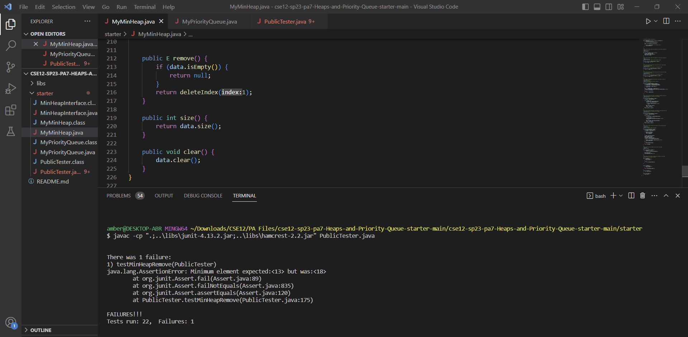
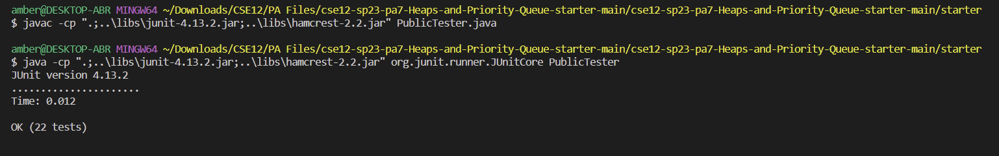

# Part 1 - Debugging Scenario
## Original Post on Edstem: 

 
### Description of the shown methods: 
public E remove() - Remove and return the root (this will be the smallest) element in the heap. Use deleteIndex() helper method here. If the heap is empty, return null instead. \
public int size()	- Return the number of elements in this min-heap. \
public void clear() -	Clear out the entire heap (the heap should be empty after this call).

### Screenshot in the post and related code:

```
    protected E deleteIndex(int index) {
        E removedE = data.get(index);
        int lastIdx = data.size() - 1;

        if (index == lastIdx) {
            data.remove(index);
            return removedE;
        }
        
        E lastE = data.get(lastIdx);
        data.set(index, lastE);
        data.remove(lastIdx);
        E element = data.get(index);
        E parent = data.get(getParentIdx(index));

        if (index > 0 && element.compareTo(parent) < 0) {
            percolateUp(index);
        }
        else {
            percolateDown(index);
        }
        return removedE;
    }
```
## Response from TA: 
I beleive the error that is causing the failure after running your tests may be in your 'public E remove()' method. Take a look at the index on the line 'return deleteIndex(1);' since the root element is stored at index 0 in a typical heap implementation. 
### Error:
~~~
public E remove() {
        if (data.isEmpty()) {
            return null; 
        }
        return deleteIndex(1);
    }
~~~
## After TA Response Screenshot: 

Bug description: The bug was in the index of the E remove() method. I changed the index from 1 to 0 since the root element is stored at index 0 and not 1. The bug was fixed and the tests passed as a reult. The files that were needed was PublicTester.java and MyMinHeap.java. I was in the starter directory.

# Part 2 - Reflection
**Q:** In a couple of sentences, describe something you learned from your lab experience in the second half of this quarter that you didn’t know before. It could be a technical topic we addressed specifically, something cool you found out on your own building on labs, something you learned from a tutor or classmate, and so on. It doesn’t have to be specifically related to a lab writeup, we just want to hear about cool things you learned! \
\
**A:** From my lab experience in the second half of this quarter, I learned how to think about problems in another way from my lab partners. We would share our way of thinking and logic as we were working together. I also learned how to use commands in the terminal, bash sh, grep, echo, and cloning. The open discussion Q&A with the TAs was helpful during the end of lab.
